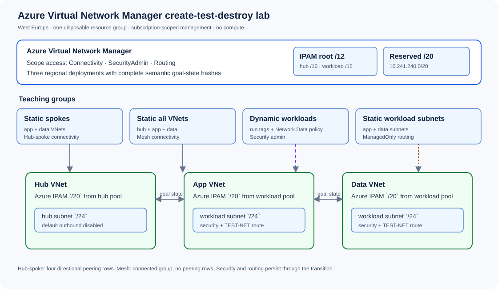

# Architecture and boundaries

The lab uses one uniquely named West Europe resource group and one Azure Virtual Network Manager whose scope is the current subscription. The manager enables `Connectivity`, `SecurityAdmin`, and `Routing`. All managed networks are in the lab resource group; the custom dynamic-membership policy definition is subscription-scoped and its assignment is limited to the lab resource group.

## Resource relationships

1. AVNM IPAM owns a root pool and two child pools. Azure allocates a `/20` to each VNet; Terraform derives the first `/24` subnet within the allocated prefix.
2. Four network groups separate the lessons: deterministic spoke membership, deterministic mesh membership, policy-driven security membership, and subnet-level routing membership.
3. Connectivity keeps one stable Azure name and ID path. Because Azure locks `ConnectivityTopology`, the runner proves a temporary Connectivity None goal state, recreates that name with the Mesh shape, and recommits it. Security and routing stay deployed and their configuration IDs remain stable.
4. Three deployment resources commit the complete regional goal state. Semantic hashes include every meaningful rule/topology value so a rule edit triggers a new commit even when the resource ID is unchanged.

## Deliberate exclusions

The lab is control-plane-only. It deploys no compute, NIC, Firewall, gateway, NAT, public IP, network watcher diagnostic, Log Analytics workspace, NSG, manual VNet peering, or user-created route table. AVNM may create managed peerings and managed route tables while its goal state is active.

The security and routing checks query Azure configuration objects. Without NICs and packet sources, they cannot prove data-plane reachability, precedence against NSGs, or NIC effective-route behavior.

## Azure scopes

- Resource group: manager, pools, VNets/subnets, groups, static members, configurations, rules, and policy assignment.
- Subscription: AVNM scope and the custom `Microsoft.Network.Data` policy definition.
- Region: all three AVNM deployments target the selected location, defaulting to West Europe.
- Shared managed resource group: Azure may use `AVNM_Managed_ResourceGroup_<subscriptionId>` for routing artifacts. The lab tracks its exact route-table IDs but never deletes that shared group.
