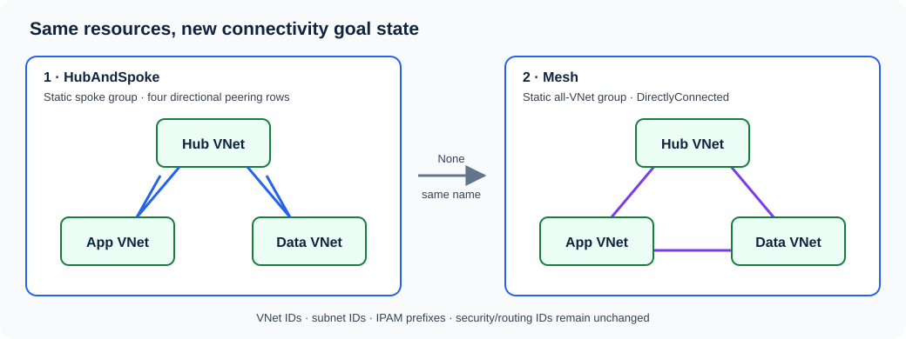
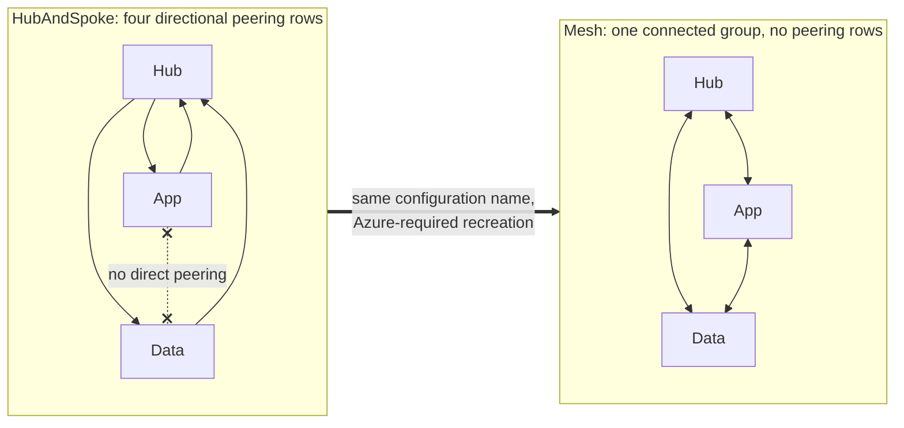

# Connectivity and hub-to-mesh exercise

The lab keeps one connectivity configuration name and ID path across both stages. Azure locks `ConnectivityTopology` after creation, so a HubAndSpoke configuration cannot be updated directly to Mesh.

## Hub-spoke goal state

- Topology: `HubAndSpoke`
- Hub: hub VNet resource ID
- Applied group: static app/data spoke group
- Group connectivity: `None`
- Hub gateway use: disabled

Azure should materialize two logical hub-spoke relationships as four directional peering rows: hub→app, app→hub, hub→data, and data→hub. There must be no app↔data peering.

## Mesh goal state

- Topology: `Mesh`
- Applied group: static all-VNet group
- Group connectivity: `DirectlyConnected`
- Global mesh: disabled

AVNM represents this as a connected group, not as three pairs of VNet peering resources. The positive test is an effective Mesh configuration on every VNet; the cleanup test is that all old AVNM hub-spoke peering rows disappear.

In both modes, overlapping addresses, existing-peering deletion, peering enforcement, global mesh, and hub-gateway use are disabled. Between modes, the runner deletes only the Connectivity deployment resource, proves an empty Connectivity goal state and zero peering rows, then explicitly replaces the configuration under the same Azure name and creates its Mesh deployment. The plan is rejected unless those are its exact resource actions. After apply, the runner proves stable VNet IDs, subnet IDs, prefix allocations, and all three configuration ID paths.

To inspect the Terraform difference without applying it, compare [hub-spoke.tfvars](../environments/hub-spoke.tfvars) with [mesh.tfvars](../environments/mesh.tfvars); `topology_mode` is their only difference.
