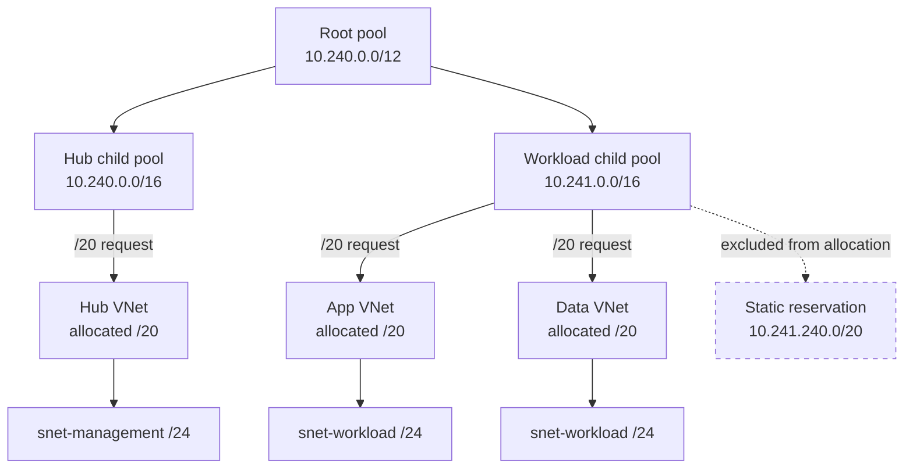

# IPAM address plan

Azure Virtual Network Manager IPAM is authoritative for the VNet address spaces. Terraform requests allocation sizes; it does not pick the final VNet prefixes.

| Pool or allocation | CIDR / request | Purpose |
| --- | --- | --- |
| Root | `10.240.0.0/12` | Lab IPAM boundary |
| Hub child | `10.240.0.0/16` | Hub allocations |
| Workload child | `10.241.0.0/16` | App/data allocations |
| Reservation | `10.241.240.0/20` | Demonstrates a protected exclusion |
| Hub VNet | one `/20` request | Allocated from hub child |
| App VNet | one `/20` request | Allocated from workload child |
| Data VNet | one `/20` request | Allocated from workload child |
| Each subnet | derived `/24` | First `/24` inside its allocated VNet prefix |

Mocked Terraform tests prove parent containment, the static reservation, allocation request sizes, derived subnet sizes, and VNet relationships. The live runner additionally proves that Azure returned three unique, non-overlapping allocations and that workload allocations do not overlap the reservation.

IPAM pool prefixes should be treated as immutable. To learn with a different address plan, complete a verified destroy, update the variables, and start a new run. In-place pool changes are not an exercise supported by this lab.

