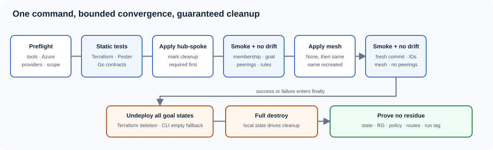

# Lifecycle and safe teardown



The runner stages all `.tf` files, modules, tests, state, plans, command logs, and evidence under a unique `%TEMP%\avnm-live-*` directory. The repository checkout remains backendless and state-free.

## Normal sequence

1. Verify tool versions, Azure context, registered providers, region support, required CLI extensions, and conflicting AVNM scope.
2. Run Terraform format/validate/mock tests, Pester, and Go repository contracts.
3. Plan/apply hub-spoke and mark cleanup required before apply.
4. Poll membership and three regional deployments, then validate IPAM, effective connectivity/security/routing, and exact peering graph.
5. Require a hub-spoke no-drift plan.
6. Delete only the Connectivity deployment resource, prove the temporary None goal state and removal of its managed peerings, then recreate the same connectivity name with the Mesh shape. Azure requires this because topology is immutable after configuration creation.
7. Require the mesh plan to contain exactly the connectivity-configuration replacement and deployment creation—no network, IPAM, security, or routing change.
8. Prove a fresh mesh commit, stable VNet/subnet IDs and prefixes, the same configuration ID paths, effective mesh, preserved security/routing, no peering rows, and a final no-drift plan.
9. In `finally`, destroy the three Terraform deployment resources first. AzureRM commits empty configuration IDs and waits for undeployment.
10. If targeted undeploy fails, post an empty goal state with Azure CLI, poll until effective configurations and managed routes are absent, then run the full Terraform destroy.
11. Verify empty state and no Azure residue associated with the run.

A `time_sleep` destroy buffer in the root module holds the network-manager delete for 90 seconds after the IPAM pools are removed, so a manual `terraform destroy` outside the runner does not intermittently fail with 409 conflicts while nested `ipamPools` settle.

## Evidence and recovery

Every native command records its exit code, output, duration, and timestamp. Sanitized JSON snapshots preserve IPAM allocations, membership, deployment records, effective configurations, peerings, routes, and outputs. Successful cleanup removes state, plans, and generated variable files but retains logs/evidence.

If cleanup cannot be proven, the full run directory is preserved and the runner exits nonzero with an exact command:

```powershell
.\scripts\invoke-live-validation.ps1 -CleanupRun '<run-directory>'
```

Do not manually remove the state directory until recovery succeeds. Do not delete the shared AVNM managed resource group.
