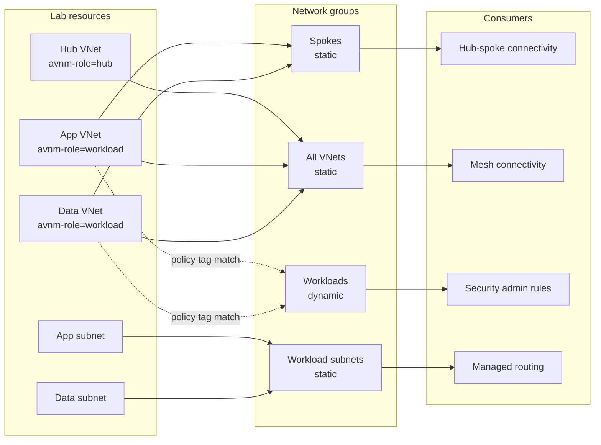

# Network groups and membership

Four groups make the different AVNM targeting models visible:

| Group | Member type | Membership | Consumer |
| --- | --- | --- | --- |
| Spokes | Virtual network | Static app + data | Hub-spoke connectivity |
| All VNets | Virtual network | Static hub + app + data | Mesh connectivity |
| Workloads | Virtual network | Dynamic app + data | Security admin rules |
| Workload subnets | Subnet | Static app + data subnets | Managed routing |

The dynamic workload group uses a custom Azure Policy definition in `Microsoft.Network.Data` mode. A VNet joins only if it belongs to the lab resource group and carries both the run-specific `avnm-run-id` tag and `avnm-role = workload`. The hub uses `avnm-role = hub`, so it must not join.

Dynamic membership is eventually consistent. The live runner queries Resource Graph repeatedly until app and data are members, the hub is absent, and all static relationships are visible. A fixed sleep would hide slow or failed policy evaluation, so every wait has a deadline and reports the last observed condition.

