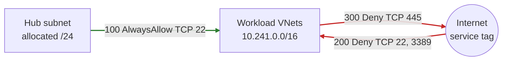

# Security admin rules

One security admin configuration targets the policy-selected workload group. Rule priority is intentional:

| Priority | Action | Direction | Source | Destination | TCP ports |
| --- | --- | --- | --- | --- | --- |
| 100 | `AlwaysAllow` | Inbound | Allocated hub subnet | Workload `/16` | 22 |
| 200 | `Deny` | Inbound | `Internet` service tag | Workload `/16` | 22, 3389 |
| 300 | `Deny` | Outbound | Workload `/16` | `Internet` service tag | 445 |

`AlwaysAllow` is stronger than a normal allow: downstream NSGs cannot block the matching flow. It is used narrowly here so engineers can see the semantic distinction, not as a production recommendation.

The live smoke test requires exactly these three rules in the effective security response for app and data and requires an empty response for the hub. Azure's effective-rules API normalizes priority values, so the runner correlates each effective rule by its full rule ID and separately reads the source rule resources to prove the configured priorities and exact semantics. Because no NIC or packet source exists, this validates only the effective AVNM goal state; it does not test actual SSH, RDP, SMB, or NSG interaction.
